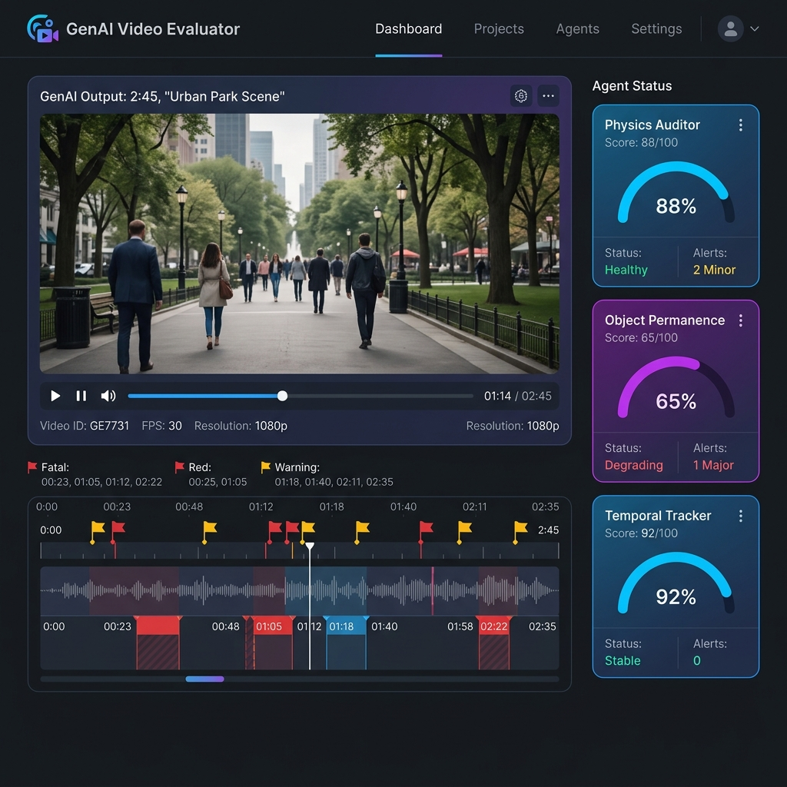

# GenAI Video Evaluator 🚀

**Autonomous Video Verification Loop solving the "Continuity Gap" in Generative Media with Multi-Agent Logic.** 



## 👁️ Vision

Foundation models generate pixels, not physics. Commercial video projects currently suffer from high "re-roll" costs due to semantic hallucinations—melting appendages, lighting flicker, and background morphing. 

**Reality Check Engine** is a closed-loop system where specialized auditors (**Gemini 3.1 Pro**) critique the artist (**Veo 3.1**). It translates visual failures into quantitative prompt corrections, automating the QC loop and fixing errors in-flight.

---

## 🏗️ System Architecture

The engine implements a multi-agent "Forensic Audit" mesh that evaluates video frames against physical and temporal ground truths.


---

## ✨ Key Features

- **Multi-Agent Forensic Audit**: Categorized evaluation (Physics, Lighting, Morphology) using Gemini 3.1 Pro.
- **Smart Continuity Mode**: Automatically selects a clean starting frame from a region with no detected issues, avoiding "poisoned" frames that contain the very artifacts being fixed. Falls back to text-only generation when the entire video is flagged.
- **Veo API Hardening**: Duration values are clamped to the valid 4-8 second range, and unsupported Vertex AI-only parameters (`referenceImages`) are excluded from Gemini API requests, preventing 400 errors.
- **Ephemeral Security**: API keys are session-based (`sessionStorage`) and auto-expire after 1 hour, ensuring no sensitive data is saved permanently.
- **Real-time Visualization**: Interactive dashboard showing coherence scores and time-coded alerts.

---

## 🔧 Recent Updates

### Smart Frame Selection for Continuity Regeneration
Previously, the Continuity strategy always used frame 0 from the original video as the starting image for Veo image-to-video generation. This caused a critical issue: if the first frame itself contained the problem (e.g., a person clipping through a railing), the regenerated video would reproduce the same defect.

**What changed:**
- **Intelligent frame selection**: The system now analyzes detected flags to compute flagged time regions, finds clean gaps between them, and extracts a frame from the earliest clean region.
- **Graceful fallback**: When the entire video is covered by flags (no clean frame available), the system falls back to text-only generation and informs the user.
- **Veo API fixes**: `durationSeconds` is now clamped to the API's valid range (4-8s), and the unsupported `referenceImages` parameter (Vertex AI-only) has been removed from Gemini API requests.
- **Accurate UI messaging**: The Continuity mode description now correctly reflects the smart frame selection behavior.

---

## 🛠️ Local Setup

Follow these steps to deploy the auditor on your machine:

1. **Clone the Repository**
   ```bash
   git clone https://github.com/moshem-a/genai-video-eval.git
   cd genai-video-eval
   ```

2. **Install Dependencies**
   ```bash
   npm install
   ```

3. **Configure Environment**
   Create a `.env` file based on `.env.example`. 
   *Note: In production, the system requires each user to provide their own Gemini API Key via the UI for session-based security.*

4. **Launch Development Server**
   ```bash
   npm run dev
   ```
   The server will be available at `localhost:5173`.

5. **Deploy to Cloud Run (Optional)**
   ```bash
   ./deploy_gcp.sh
   ```

---

## 🛡️ Technology Stack

- **Core**: React + TypeScript + Vite
- **AI Models**: Gemini 3.1 Pro (Audit), Google Veo 3.1 (Regeneration)
- **Styling**: TailwindCSS + Framer Motion
- **Deployment**: Google Cloud Run (Docker-based)

---

